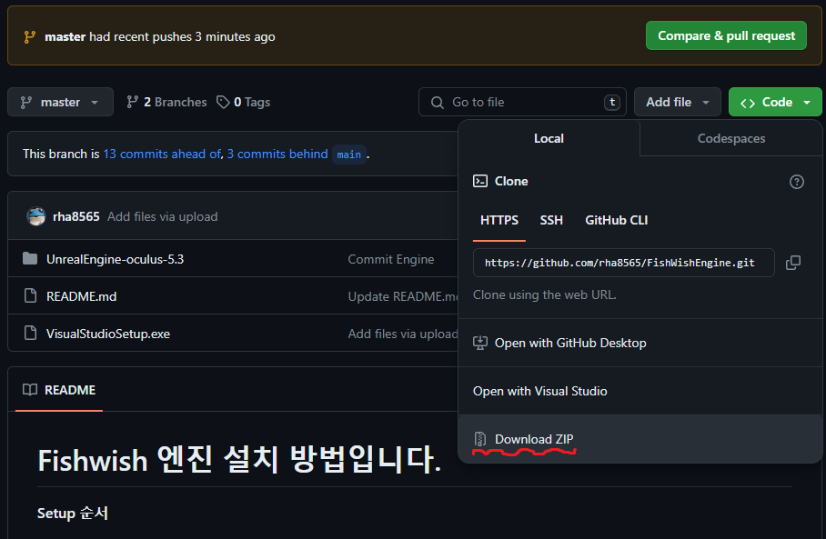
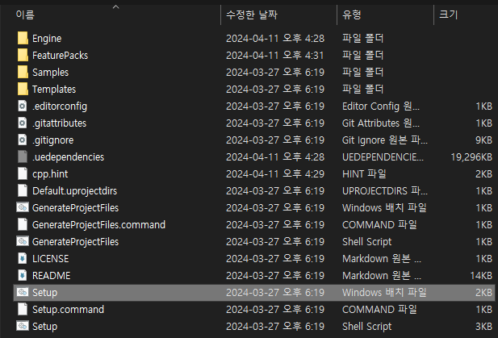
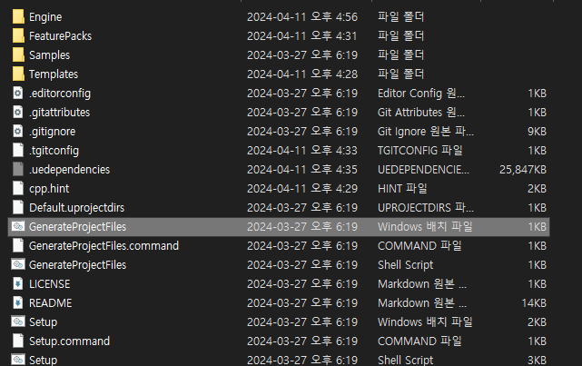
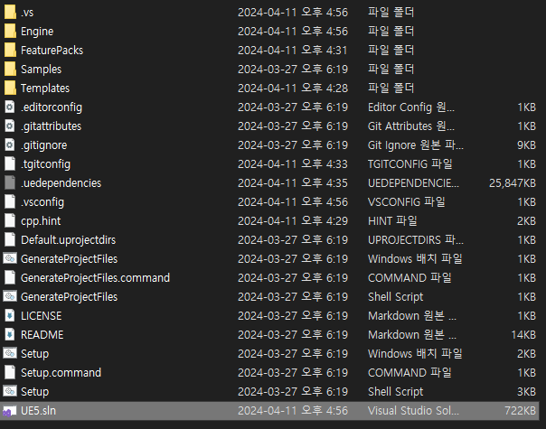
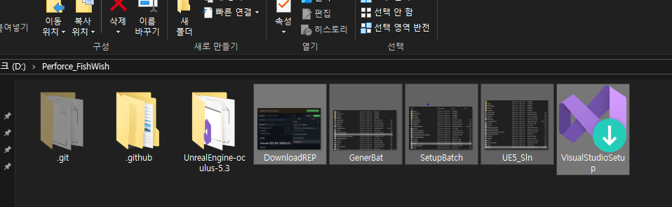

# Fishwish 엔진 설치 방법입니다.

## **Setup 순서** 
- Repository 내려받기
- 비주얼 스튜디오 다운로드
- 엔진소스 프로젝트 제너레이트
- 엔진 소스 빌드
- 퍼포스와 연결
   

## **Repository 내려받기**
 
- 진행전 새로운 Perforce 프로젝트용 폴더를 원하시는 경로에 만듭니다.
 

- 위의 그림을 참고하여 Zip 파일을 다운로드하고 Perforce 프로젝트 폴더에 압축을 풉니다.
   

## **비주얼 스튜디오 다운로드**
 
[링크는 젤다의전설 주인공 이름](http://zeldahagoshipda.com)
- [UE docs Visual Studio 구성하기](https://forums.unrealengine.com/t/unreal-5-1-package-project-for-android-error-org-codehaus-groovy-vmplugin-v7-java7-and-java-lang-unsupportedclassversionerror/793309)를 참고하여 VisualStudioSetup.exe를 실행
  비주얼 스튜디오를 다운로드합니다.
   

## **엔진소스 프로젝트 제너레이트** 

- Perforce프로젝트폴더/UnrealEngine-oculus-5.3/Setup.bat 배치파일을 실행합니다.
  (Setup파일은 여러개 그 중 Windows 배치파일을 실행해야 합니다. 10~30분정도 걸립니다.)
 

- 모두 완료되면 GenerateProjectFiles.bat 파일을 실행합니다.(1분 소요)
   

## **엔진 소스 빌드** 

- UE5.sln파일을 실행합니다.(로그인 안하셔도 됩니다.)
- 오른쪽 솔루션 탐색기에서 Engine->UE5를 우클릭하신후 빌드를 눌러주세요.(오래걸림)
- 완료되면 "퍼포스프로젝트경로\UnrealEngine-oculus-5.3\Engine\Binaries\Win64\UnrealEditor.exe"를 실행하여 작동이 되는지 확인합니다.(섀이더 컴파일 진행하면 성공)
- 문제 발생시 개발자를 부르세요.
   

## **퍼포스와 연결** 

- 우선 위의 파일들을 삭제합니다 (마크다운 정크파일, 설치파일)
- "V:\FishWish\03_Unreal\PerforceRoot_0411" 경로의 FishWish 루트폴더를 Perforce 프로젝트 폴더 경로로 복사합니다.
- 
